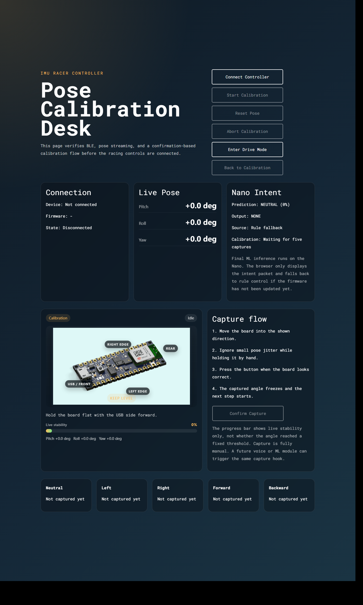
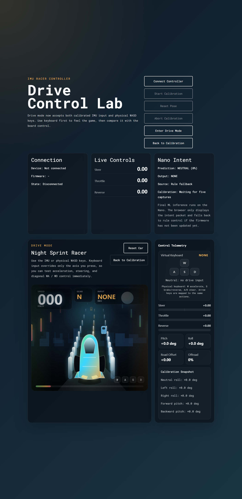
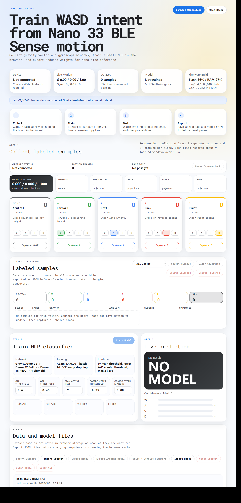

# IMU Racer Controller

Handheld IMU racing controller for Arduino Nano 33 BLE Sense.

The project uses the onboard IMU for motion input, BLE for communication, a browser calibration/racing interface, and a browser trainer that exports Arduino-side MLP weights.

## Screenshots

### Calibration Page



### Drive Mode



### Online Trainer



## What Is Included

- `firmware/`: Arduino Nano 33 BLE Sense firmware.
- `web/`: Svelte Web Bluetooth app and local Node server.
- `start_web.bat`: Windows one-click launcher for the calibration and racing page.
- `start_trainer.bat`: Windows one-click launcher for the motion dataset and model training page.

## Requirements

- Arduino Nano 33 BLE Sense.
- Arduino IDE with `Arduino Mbed OS Nano Boards` installed.
- Arduino libraries:
  - `ArduinoBLE`
  - `Arduino_LSM9DS1`
- Node.js LTS with `npm`.
- Chrome or Microsoft Edge with Web Bluetooth support.
- Windows is recommended because the project includes `.bat` launchers.

Optional for trainer-side firmware compile:

- Arduino IDE installed in the default Windows path, or `arduino-cli` available in `PATH`.
- If `arduino-cli` is installed elsewhere, set the `ARDUINO_CLI` environment variable to its full path.

## Run On Windows

1. Clone or download this repository.
2. Open `firmware/firmware.ino` in Arduino IDE.
3. Select `Arduino Nano 33 BLE Sense`.
4. Upload the firmware to the board.
5. Double-click `start_web.bat` for calibration and racing control.
6. Double-click `start_trainer.bat` when collecting labeled IMU data and exporting a model.

The startup scripts install web dependencies when `web/node_modules` is missing, build the frontend, release the local server port if it is already occupied, and open the correct browser page.

## Run Manually

If you do not use the `.bat` files:

```powershell
cd web
npm install
npm run build
npm run start -- --host 127.0.0.1 --port 4173
```

Then open the calibration/racing page or trainer page in a Web Bluetooth compatible browser.

## Current Control Design

- The controller outputs virtual `W/A/S/D` intent.
- `NEUTRAL` means all keys are released.
- `WA` and `WD` are produced at runtime by combining forward and steering probabilities.
- Final ML inference is designed to run on the Nano firmware.
- The browser is used for calibration, visualization, data collection, training, and testing.

## Training Workflow

1. Upload the firmware.
2. Open the trainer with `start_trainer.bat`.
3. Connect the Nano 33 BLE Sense from the browser.
4. Capture labeled samples for `NEUTRAL`, `W`, `A`, `S`, and `D`.
5. Train the MLP model in the browser.
6. Export the Arduino model header or use the trainer compile action.
7. Re-upload the firmware after replacing `firmware/model_weights.h`.

## Repository Notes

- Frontend build output is generated locally and is not committed.
- `node_modules` is not committed.
- Development logs, private report Markdown files, and temporary report browser profiles are intentionally excluded.
